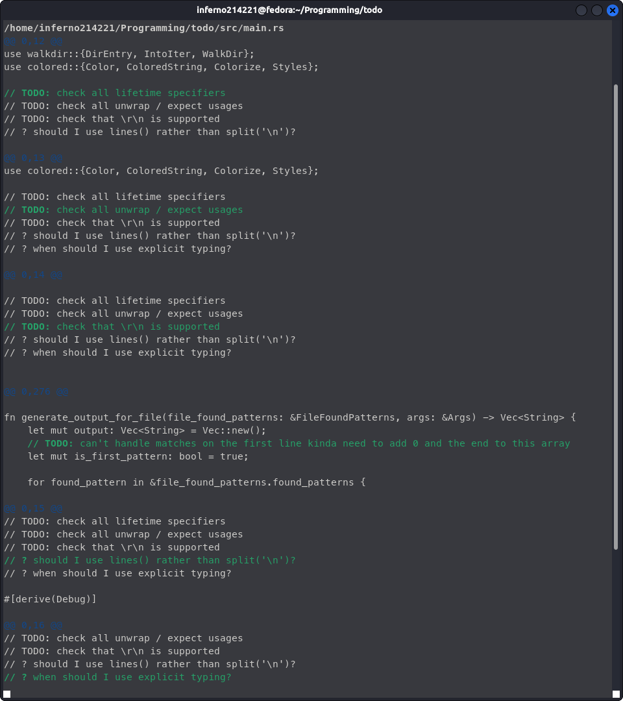

# Todo

I haven't fully decided on a name for this project yet but one option is 'todo'. This is a command line utility written in Rust (largely as a learning experience) which searches all input files and directories for strings or regexes and then outputting them in a customisable diff-like format. One of the primary uses of this program is intended to find all TODO or FIXME comments in a project and produce a checklist with the location and context for each.

# Usage

// TODO: write usage guide & help docs

## Examples

### Diff-Like Output (Default)

Command:
```sh
todo ./src/main.rs -r "// ?TODO: ?" -r "// ?\? ?"
```
Or (With Format Defined Manually):
```sh
todo ./src/main.rs -r "// ?TODO: ?" -r "// ?\? ?" -f "%bold%%file%\n%clear%" -m "%blue%@@ %x%,%y% @@\n%white%%context_before%\n%green%%before%%bold%%match%%clear%%after%\n%white%%context_after%\n"
```


### Short Markdown List

Command:
```sh
todo ./src/main.rs -r "// ?TODO: ?" -r "// ?\? ?" -f "# %file%\n\n" -m "\- [ ] %match%%after% \\[Ln %y%, Col %x%]\n" -o <OUTPUT_FILE>
```
[Output](./demos/short.md)

### Full Markdown List

Command:
```sh
todo ./src/main.rs -r "// ?TODO: ?" -r "// ?\? ?" -f "# %file%\n\n" -m "## %match%\n\n\- [ ] \\[Ln %y%, Col %x%]\n\`\`\`%file_ext%\n%context_before%\n\`\`\`\n\`%before%%match%\`**%after%**\n\`\`\`%file_ext%\n%context_after%\n\`\`\`\n" -o <OUTPUT_FILE>
```
[Output](./demos/full.md)